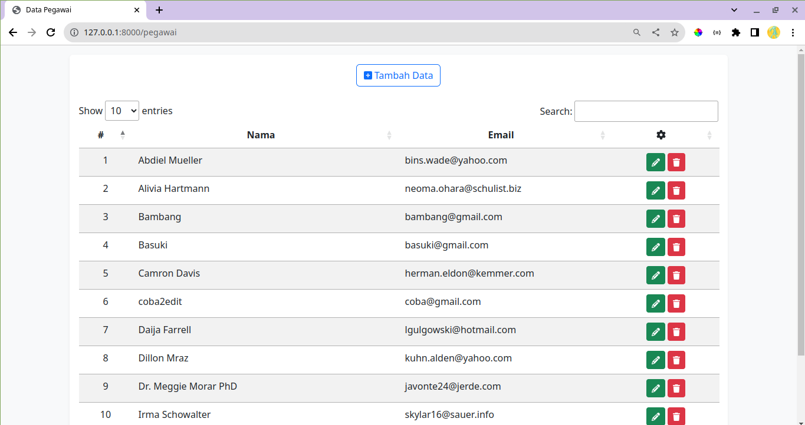


## Aplikasi CRUD Data Pegawai
### Laravel | Ajax | jQuery

<br><br>
### Requirements
- PHP ( v >= 8.0 )

<br><br>
### Installations

<b>Step 1:</b>
<br>
Initialize git
```
git init
```

<center>

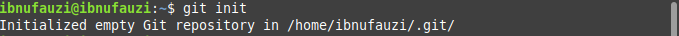

</center>

<br>
<b>Step 2:</b>
<br>
clone in your repository

```
git clone https://github.com/ibnuahmadfauzi/crud-laravel-ajax-jquery.git
```

<center>

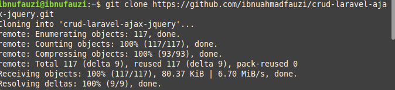

</center>

<br>
<b>Step 3:</b>
<br>
Duplicate file <b>.env.example</b> by name <b>.env</b> and edit <b>DB_DATABASE</b>
<center>

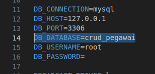

</center>
<br><br>
<b>Step 4:</b>
<br>
Create a database with the same name
<center>

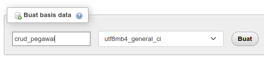

</center>
<br>
<b>Step 5:</b>
<br>
Install dependencies

```
composer install
```

<center>

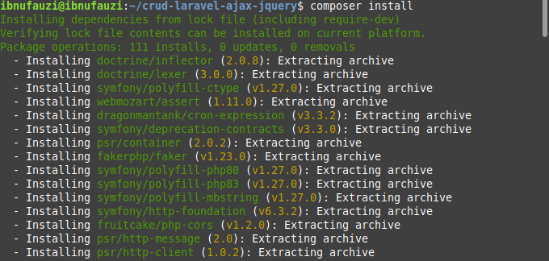

</center>

<br><br>
<b>Step 6:</b>
<br>
Run migrations

```
php artisan migrate
```

<center>

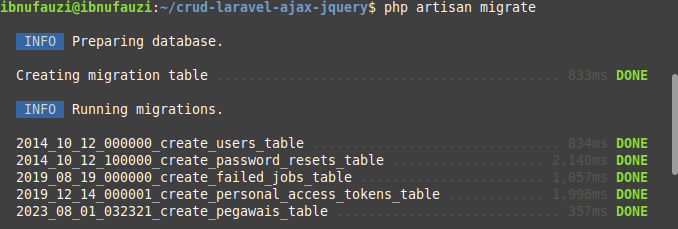

</center>

<br><br>
<b>Step 7:</b>
<br>
Run seeders

```
php artisan db:seed
```

<center>

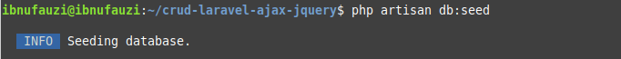

</center>


<br><br>
<b>Step 8:</b>
<br>
Sets the APP_KEY value

```
php artisan key:generate
```

<center>

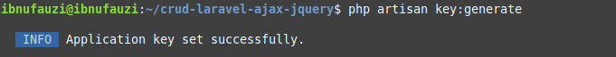

</center>


<br><br>
<b>Step 9:</b>
<br>
Run your application

```
php artisan serve
```

<center>

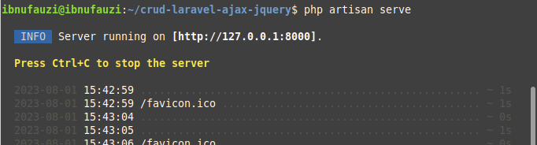

</center>


<br><br>
<b>Step 10:</b>
<br>
Finish (✦ ‿ ✦)

<center>

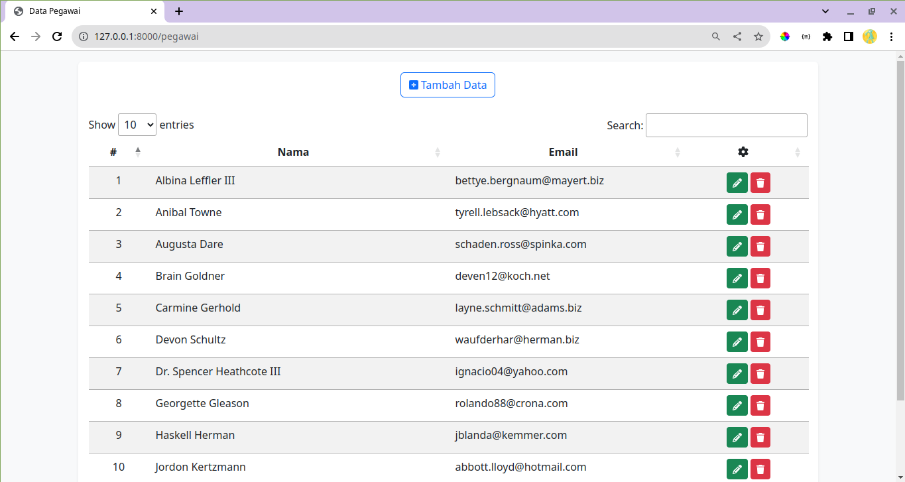

</center>
